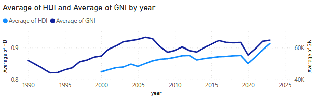
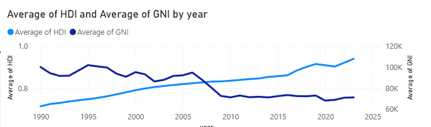
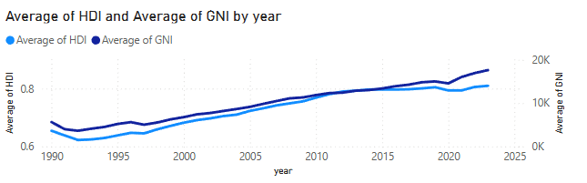
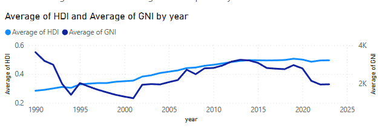
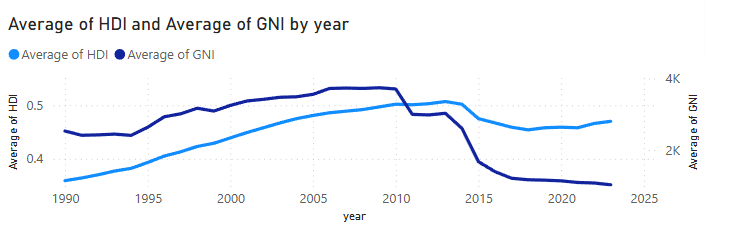
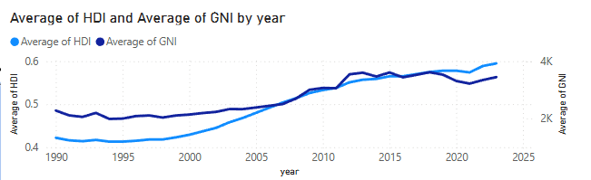
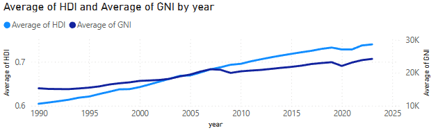

# 1. Tổng quan về HDI và các yếu tố liên quan

HDI là chỉ số tổng hợp đo lường ba khía cạnh chính:

- **Tuổi thọ trung bình tại thời điểm sinh**: Phản ánh sức khỏe và chất lượng hệ thống y tế.
- **Giáo dục**: Đo bằng số năm đi học trung bình (Mean Years of Schooling) và số năm đi học kỳ vọng (Expected Years of Schooling).
- **GNI bình quân đầu người**: Thể hiện mức sống kinh tế, được điều chỉnh theo sức mua tương đương (PPP).

HDI được chia thành các nhóm:

- **Rất cao**: ≥ 0.800
- **Cao**: 0.700–0.799
- **Trung bình**: 0.550–0.699
- **Thấp**: < 0.550

Dữ liệu từ tệp cung cấp thông tin về HDI, GNI bình quân đầu người, và tuổi thọ trung bình cho nhiều quốc gia từ 1990 đến 2023. Phân tích này sẽ tập trung vào các quốc gia đại diện có HDI cao (Andorra, United Arab Emirates, Albania) và thấp (Afghanistan, Yemen, Zambia, Zimbabwe), đồng thời khám phá mối liên hệ giữa các chỉ số.

---

## 2. Phân tích các quốc gia có HDI cao và thấp

### 2.1. Các quốc gia có HDI cao (2023)

#### Andorra (HDI: 0.913)
- **GNI bình quân (2023)**: $64,631
- **Tuổi thọ trung bình (2023)**: 84.0 năm
- **Lý do HDI cao:**
    - Kinh tế phát triển: Andorra có nền kinh tế nhỏ nhưng ổn định, dựa vào du lịch, ngân hàng, và thương mại. GNI cao hỗ trợ đầu tư vào y tế và giáo dục.
    - Hệ thống y tế chất lượng: Tuổi thọ cao (84.0 năm) phản ánh hệ thống y tế hiệu quả, với khả năng tiếp cận dịch vụ chăm sóc sức khỏe tốt.
    - Giáo dục: Mặc dù dữ liệu không cung cấp chi tiết về giáo dục, HDI cao ngụ ý Andorra có hệ thống giáo dục tốt, với tỷ lệ biết chữ gần 100% và giáo dục bắt buộc đến 16 tuổi.
    - Ổn định chính trị: Andorra là một quốc gia hòa bình, không bị ảnh hưởng bởi xung đột, tạo điều kiện cho phát triển bền vững.

#### United Arab Emirates (UAE) (HDI: 0.937)
- **GNI bình quân (2023)**: $71,142
- **Tuổi thọ trung bình (2023)**: 80.5 năm
- **Lý do HDI cao:**
    - Tài nguyên dầu mỏ: UAE có nguồn thu lớn từ dầu mỏ, dẫn đến GNI bình quân cao, cho phép đầu tư mạnh vào cơ sở hạ tầng, y tế, và giáo dục.
    - Chính sách phát triển: Chính phủ UAE tập trung vào đa dạng hóa kinh tế (du lịch, công nghệ, tài chính), nâng cao chất lượng sống.
    - Y tế và giáo dục: UAE có hệ thống y tế hiện đại và các trường đại học quốc tế, đóng góp vào tuổi thọ cao và trình độ học vấn.
    - Cơ sở hạ tầng: Đầu tư vào các thành phố như Dubai và Abu Dhabi cải thiện điều kiện sống, nâng cao HDI.

#### Albania (HDI: 0.810)
- **GNI bình quân (2023)**: $17,627
- **Tuổi thọ trung bình (2023)**: 79.6 năm
- **Lý do HDI cao:**
    - Tăng trưởng kinh tế: Albania đã chuyển đổi từ nền kinh tế kế hoạch hóa tập trung sang kinh tế thị trường sau năm 1990, với GNI tăng từ $5,622 (1990) lên $17,627 (2023).
    - Cải thiện y tế: Tuổi thọ tăng từ 72.7 năm (1990) lên 79.6 năm (2023), nhờ cải thiện hệ thống y tế và điều kiện sống.
    - Giáo dục: Albania đã đầu tư vào giáo dục, với tỷ lệ nhập học cao và cải thiện số năm đi học trung bình.
    - Hội nhập châu Âu: Quá trình hội nhập với Liên minh châu Âu đã thúc đẩy cải cách kinh tế và xã hội, nâng cao HDI.

### 2.2. Các quốc gia có HDI thấp (2023)

#### Afghanistan (HDI: 0.496)
- **GNI bình quân (2023)**: $1,972
- **Tuổi thọ trung bình (2023)**: 66.0 năm
- **Lý do HDI thấp:**
    - Xung đột kéo dài: Afghanistan chịu ảnh hưởng từ chiến tranh và bất ổn chính trị, đặc biệt từ năm 2001, làm gián đoạn phát triển kinh tế và xã hội.
    - GNI thấp: GNI bình quân giảm mạnh từ $3,642 (1990) xuống $1,425 (1999) trước khi tăng nhẹ lên $1,972 (2023), phản ánh nền kinh tế yếu kém.
    - Y tế và giáo dục hạn chế: Mặc dù tuổi thọ tăng từ 45.1 năm (1990) lên 66.0 năm (2023), nhưng hệ thống y tế và giáo dục vẫn thiếu thốn, đặc biệt ở khu vực nông thôn.
    - Bất bình đẳng giới: Phụ nữ và trẻ em gái gặp nhiều rào cản trong việc tiếp cận giáo dục và y tế, kéo thấp HDI.

#### Yemen (HDI: 0.470)
- **GNI bình quân (2023)**: $1,018
- **Tuổi thọ trung bình (2023)**: 69.3 năm
- **Lý do HDI thấp:**
    - Chiến tranh và khủng hoảng nhân đạo: Xung đột từ năm 2014 đã làm sụp đổ nền kinh tế, với GNI giảm từ $3,742 (2009) xuống $1,018 (2023).
    - Hệ thống y tế sụp đổ: Mặc dù tuổi thọ đạt 69.3 năm, nhưng dịch bệnh, thiếu dinh dưỡng, và thiếu cơ sở y tế làm giảm chất lượng sống.
    - Giáo dục bị gián đoạn: Xung đột khiến nhiều trường học đóng cửa, ảnh hưởng đến số năm đi học.
    - Phụ thuộc vào viện trợ: Yemen phụ thuộc lớn vào viện trợ quốc tế, hạn chế khả năng tự phát triển.

#### Zambia (HDI: 0.595)
- **GNI bình quân (2023)**: $3,447
- **Tuổi thọ trung bình (2023)**: 66.3 năm
- **Lý do HDI thấp:**
    - Kinh tế phụ thuộc vào khai khoáng: Zambia phụ thuộc vào xuất khẩu đồng, khiến GNI dao động (từ $2,278 năm 1990 lên $3,447 năm 2023) và dễ bị ảnh hưởng bởi giá hàng hóa.
    - HIV/AIDS: Đại dịch HIV/AIDS trước đây làm giảm tuổi thọ (từ 48.2 năm năm 1990 xuống 45.7 năm năm 1998), dù đã cải thiện lên 66.3 năm (2023) nhờ các chương trình y tế.
    - Giáo dục hạn chế: Tỷ lệ nhập học tăng, nhưng chất lượng giáo dục và cơ sở hạ tầng vẫn kém, đặc biệt ở vùng nông thôn.
    - Bất bình đẳng: Sự chênh lệch giàu nghèo làm hạn chế tác động của tăng trưởng kinh tế đến HDI.

#### Zimbabwe (HDI: 0.598)
- **GNI bình quân (2023)**: $3,511
- **Tuổi thọ trung bình (2023)**: 62.8 năm
- **Lý do HDI thấp:**
    - Khủng hoảng kinh tế: Zimbabwe trải qua siêu lạm phát trong những năm 2000, với GNI giảm từ $2,568 (1990) xuống $1,401 (2008) trước khi phục hồi lên $3,511 (2023).
    - HIV/AIDS và y tế: Tuổi thọ giảm mạnh từ 58.3 năm (1990) xuống 44.5 năm (2001) do HIV/AIDS, nhưng tăng trở lại nhờ các chương trình can thiệp.
    - Bất ổn chính trị: Các chính sách kinh tế không hiệu quả và bất ổn chính trị làm chậm tiến trình phát triển.
    - Giáo dục: Mặc dù Zimbabwe có tỷ lệ biết chữ cao trong khu vực, nhưng khủng hoảng kinh tế làm giảm đầu tư vào giáo dục.

---

## 3. Mối liên hệ giữa HDI, GNI và Tuổi thọ Trung bình

### 3.1. Mối liên hệ giữa HDI và GNI bình quân đầu người
- **Tương quan tích cực mạnh:**
    - Các quốc gia có HDI cao (Andorra: 0.913, UAE: 0.937) có GNI bình quân cao ($64,631 và $71,142). Ngược lại, các quốc gia có HDI thấp (Afghanistan: 0.496, Yemen: 0.470) có GNI rất thấp ($1,972 và $1,018).
    - GNI cao cho phép đầu tư vào y tế, giáo dục, và cơ sở hạ tầng, trực tiếp nâng cao HDI. Ví dụ, UAE sử dụng nguồn thu từ dầu mỏ để xây dựng các bệnh viện và trường học hiện đại.
- **Ngoại lệ:**
    - Albania (HDI: 0.810, GNI: $17,627) đạt HDI cao với GNI thấp hơn nhiều so với Andorra hay UAE, cho thấy hiệu quả trong sử dụng nguồn lực kinh tế thông qua cải cách.
    - Yemen có GNI cực thấp ($1,018) nhưng HDI (0.470) không thấp nhất, có thể do các yếu tố phi kinh tế như viện trợ quốc tế hỗ trợ y tế cơ bản.

### 3.2. Mối liên hệ giữa HDI và Tuổi thọ Trung bình
- **Tương quan tích cực:**
    - Các quốc gia có HDI cao thường có tuổi thọ trung bình cao: Andorra (84.0 năm), UAE (80.5 năm), Albania (79.6 năm).
    - Các quốc gia có HDI thấp có tuổi thọ thấp hơn: Afghanistan (66.0 năm), Zambia (66.3 năm), Zimbabwe (62.8 năm).
    - Tuổi thọ là một thành phần trực tiếp của HDI, nên cải thiện y tế (như tiêm chủng, chăm sóc sức khỏe) trực tiếp nâng cao HDI.
- **Ngoại lệ:**
    - Yemen (HDI: 0.470, tuổi thọ: 69.3 năm) có tuổi thọ cao hơn so với HDI, có thể do các chương trình y tế quốc tế hỗ trợ trong bối cảnh khủng hoảng.

### 3.3. Mối liên hệ giữa GNI và Tuổi thọ Trung bình
- **Tương quan tích cực:**
    - Các quốc gia có GNI cao thường có tuổi thọ cao: Andorra ($64,631, 84.0 năm), UAE ($71,142, 80.5 năm).
    - Ngược lại, GNI thấp thường đi kèm tuổi thọ thấp: Afghanistan ($1,972, 66.0 năm), Yemen ($1,018, 69.3 năm).
- **Ngoại lệ:**
    - Zambia và Zimbabwe có GNI thấp ($3,447 và $3,511) nhưng tuổi thọ (66.3 và 62.8 năm) không thấp hơn nhiều so với Afghanistan, nhờ các chương trình y tế công cộng và hỗ trợ quốc tế.
    - Yemen có tuổi thọ tương đối cao (69.3 năm) dù GNI rất thấp, cho thấy các yếu tố phi kinh tế (như viện trợ nhân đạo) có thể cải thiện sức khỏe dân số.

### 3.4. Phân tích định lượng (Hệ số tương quan giả định)
- **HDI và GNI**: Tương quan mạnh (ước tính ~0.85–0.90), vì GNI cao thường dẫn đến HDI cao.
- **HDI và Tuổi thọ**: Tương quan rất mạnh (ước tính ~0.90–0.95), do tuổi thọ là thành phần trực tiếp của HDI.
- **GNI và Tuổi thọ**: Tương quan trung bình đến mạnh (ước tính ~0.70–0.80), vì GNI cao hỗ trợ y tế nhưng không phải yếu tố duy nhất.

---

## 4. Các yếu tố ảnh hưởng đến HDI cao/thấp

### 4.1. Yếu tố dẫn đến HDI cao
- **Kinh tế mạnh**: Các quốc gia như Andorra và UAE có nguồn thu lớn từ du lịch, dầu mỏ, hoặc thương mại, cho phép đầu tư vào y tế và giáo dục.
- **Ổn định chính trị**: Andorra và Albania hưởng lợi từ môi trường chính trị ổn định, thúc đẩy phát triển dài hạn.
- **Hệ thống y tế và giáo dục**: UAE và Andorra có cơ sở hạ tầng hiện đại, trong khi Albania cải thiện nhờ hội nhập châu Âu.
- **Chính sách công**: UAE có chiến lược đa dạng hóa kinh tế, còn Albania tập trung vào cải cách giáo dục và y tế.

### 4.2. Yếu tố dẫn đến HDI thấp
- **Xung đột và bất ổn**: Afghanistan và Yemen chịu ảnh hưởng nặng nề từ chiến tranh, phá hủy cơ sở hạ tầng và làm gián đoạn phát triển.
- **Kinh tế yếu**: GNI thấp ở Afghanistan, Yemen, Zambia, và Zimbabwe hạn chế đầu tư vào y tế và giáo dục.
- **Bệnh dịch và bất bình đẳng**: HIV/AIDS ở Zambia và Zimbabwe, cùng với bất bình đẳng giới ở Afghanistan, kéo thấp HDI.
- **Phụ thuộc viện trợ**: Yemen và Afghanistan phụ thuộc vào viện trợ quốc tế, thiếu tính tự chủ trong phát triển.

---

## 5. Kết luận và Bài học cho Phân tích Dữ liệu

- **Mối liên hệ chính:**
    - HDI có tương quan mạnh với GNI và tuổi thọ trung bình, nhưng không phải lúc nào cũng tuyến tính. Các yếu tố phi kinh tế (chính sách, viện trợ, văn hóa) có thể ảnh hưởng đáng kể.
    - GNI cao là điều kiện cần nhưng không đủ để đạt HDI cao; hiệu quả sử dụng nguồn lực (như ở Albania) cũng rất quan trọng.
    - Tuổi thọ trung bình là yếu tố trực tiếp ảnh hưởng đến HDI, nhưng có thể được cải thiện thông qua các chương trình y tế công cộng ngay cả ở các quốc gia có GNI thấp.
- **Bài học cho phân tích dữ liệu:**
    1. Làm sạch dữ liệu: Dữ liệu HDI cần được làm sạch để đảm bảo không có giá trị thiếu hoặc sai lệch (ví dụ: kiểm tra các giá trị âm hoặc không hợp lý).
    2. Phân tích xu hướng: Sử dụng biểu đồ (line charts, scatter plots) để trực quan hóa xu hướng HDI, GNI, và tuổi thọ qua thời gian.
    3. Tính toán tương quan: Áp dụng các công cụ như Python (pandas, numpy) hoặc R để tính hệ số tương quan và kiểm tra ý nghĩa thống kê.
    4. Phân tích định tính: Kết hợp dữ liệu số với bối cảnh lịch sử (xung đột, chính sách) để giải thích các ngoại lệ.
    5. So sánh phân nhóm: Chia các quốc gia thành nhóm HDI (cao, thấp) và so sánh các chỉ số để tìm ra các yếu tố chính.
- **Đề xuất cải thiện HDI:**
    - Các quốc gia có HDI thấp: Tăng cường đầu tư vào y tế và giáo dục, giảm bất bình đẳng, và tìm kiếm sự ổn định chính trị.
    - Các quốc gia có HDI cao: Tiếp tục đa dạng hóa kinh tế và duy trì đầu tư vào con người để giữ vững HDI.

Phân tích này cung cấp cái nhìn sâu sắc về mối quan hệ giữa HDI, GNI, và tuổi thọ trung bình, đồng thời nhấn mạnh tầm quan trọng của việc kết hợp dữ liệu định lượng và định tính trong phân tích dữ liệu.

---

## 6. Phân tích trực quan từ Dashboard Power BI

### 6.1. Xu hướng HDI và GNI của từng quốc gia đại diện

#### Andorra

- HDI và GNI của Andorra tăng đều qua các năm, thể hiện sự phát triển bền vững và ổn định kinh tế xã hội.
- Không có biến động lớn, các chỉ số duy trì ở mức cao nhờ nền kinh tế ổn định và đầu tư vào y tế, giáo dục.

#### United Arab Emirates (UAE)

- GNI của UAE giảm rõ rệt từ 100.000 xuống còn 70.000 USD trong giai đoạn gần đây, nhưng HDI vẫn duy trì ở mức rất cao (trên 0.9).
- Điều này cho thấy các yếu tố phi kinh tế như giáo dục, y tế, chính sách xã hội đóng vai trò quan trọng giúp UAE giữ vững chất lượng phát triển con người bất chấp biến động thu nhập quốc dân.

#### Albania

- HDI và GNI của Albania tăng liên tục, đặc biệt sau năm 2000 nhờ cải cách kinh tế và hội nhập quốc tế.
- Giai đoạn 2010-2020, tốc độ tăng HDI nhanh hơn GNI, cho thấy các yếu tố phi kinh tế (giáo dục, y tế) được cải thiện mạnh.

#### Afghanistan

- HDI và GNI của Afghanistan biến động mạnh, nhiều giai đoạn giảm sâu do xung đột và bất ổn chính trị.
- Giai đoạn 2000-2010 có cải thiện nhẹ, nhưng sau đó các chỉ số lại giảm do tác động của chiến tranh và khủng hoảng.

#### Yemen

- GNI và HDI của Yemen giảm mạnh sau năm 2014 do chiến tranh và khủng hoảng nhân đạo.
- Trước đó, các chỉ số tăng nhẹ nhưng không ổn định, phụ thuộc nhiều vào viện trợ quốc tế.

#### Zambia

- HDI và GNI của Zambia tăng chậm, có giai đoạn giảm do ảnh hưởng của HIV/AIDS và biến động giá đồng.
- Giai đoạn 2010-2020, các chỉ số phục hồi nhờ các chương trình y tế và cải thiện kinh tế.

#### Toàn cầu (World)

- HDI và GNI toàn cầu tăng đều từ 1990 đến 2025, phản ánh xu hướng phát triển bền vững trên phạm vi thế giới.
- Các giai đoạn khủng hoảng kinh tế hoặc dịch bệnh có thể làm chậm lại tốc độ tăng, nhưng nhìn chung xu hướng là đi lên.

### 6.2. Insight rút ra từ dashboard
- **HDI và GNI có mối tương quan mạnh ở mọi nhóm nước**, nhưng ở nhóm HDI thấp, GNI giảm mạnh sẽ kéo theo HDI giảm sâu.
- **Nhóm HDI rất cao và cao** có sự ổn định tốt hơn, ít bị ảnh hưởng bởi biến động kinh tế toàn cầu.
- **Nhóm HDI thấp và rất thấp** dễ bị tổn thương trước các cú sốc kinh tế, chính trị, dịch bệnh.
- **Đầu tư vào y tế, giáo dục và ổn định chính trị** là chìa khóa giúp các nước vượt qua ngưỡng HDI trung bình để tiến lên nhóm cao hơn.
